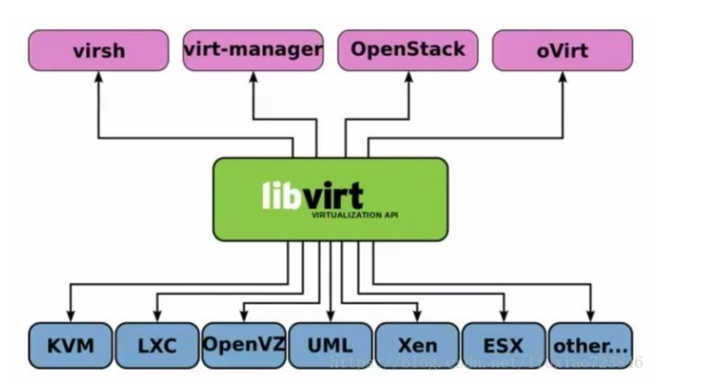

# 一、虚拟化 Virtualization
1. 在计算机技术中，`虚拟化`（技术）或虚拟技术（英语：Virtualization）是一种资源管理技术，是将计算机的各种**实体资源（CPU、内存、磁盘空间、网络适配器等）**，予以抽象、转换后呈现出来并可供分割、组合为*一个或多个电脑配置环境*。由此，打破实体结构间的不可切割的障碍，使用户可以比原本的配置更好的方式来应用这些电脑硬件资源。这些资源的新虚拟部分是不受现有资源的架设方式，地域或物理配置所限制。一般所指的虚拟化资源包括**计算、存储、网络（简写：机盘网）**
2. 借助虚拟化技术，用户能以单个物理硬件系统为基础创建多个模拟环境或专用资源。一款名为 `Hypervisor`（虚拟机监控程序）的软件可直接连接到硬件，从而将一个系统划分为不同的、单独安全环境，即`虚拟机（VM）`。
3. 虚拟化的优势：借助虚拟化资源，管理员能够对**物理资源进行池化**，从而真正发挥硬件的价值。因此，可以对那些维护代价高、但支持重要应用的传统基础架构进行虚拟化，从而实现优化利用。
> 虚拟化与云计算的区别
    - 虚拟化是一种将功能与硬件分离的技术
    - 而云计算并不仅仅是依赖于这种分离的解决方案
    - 美国国家标准与技术协会这样描述云计算的 5 种功能：一个网络、池化资源、一个用户界面、置备功能、自动化资源控制/分配。
    - 虽然虚拟化可以创建网络和池化资源，但还需要其他管理和操作系统软件来创建用户界面、部署虚拟机、控制/分配资源。

# 二、虚拟化技术

1. 实现虚拟化的技术主要有：*Xen、OpenVZ、KVM、Hyper-V、VMWare*等

## 1. KVM、QEMU
1. KVM(Kernel-based Virtual Machine)是集成到Linux内核的Hypervisor，是X86架构且硬件支持虚拟化技术（Intel VT或AMD-V）的Linux的全虚拟化解决方案。它是Linux的一个很小的模块，利用Linux做大量的事，如任务调度、内存管理与硬件设备交互等。
3. **KVM负责cpu虚拟化+内存虚拟化，实现了cpu和内存的虚拟化，但kvm不能模拟其他设备**
4. **qemu是模拟IO设备（网卡，磁盘），kvm加上qemu之后就能实现真正意义上服务器虚拟化**
5. 因为用到了上面两个东西，所以一般都称之为`qemu-kvm`
6. **libvirt则是调用kvm虚拟化技术的接口用于管理的**，用libvirt管理方便，直接用qemu-kvm的接口太繁琐。
7. libvirt是目前使用最为广泛的对KVM虚拟机进行管理的工具和API。Libvirtd是一个daemon进程，可以被本地的virsh调用，也可以被远程的virsh调用，Libvirtd调用qemu-kvm操作虚拟机。

## 2. Xen
1. Xen是第一类运行在裸机上的虚拟化管理程序(Hypervisor)。它支持全虚拟化和半虚拟化,Xen支持hypervisor和虚拟机互相通讯，而且提供在所有Linux版本上的免费产品，包括Red Hat Enterprise Linux和SUSE Linux Enterprise Server。
2. Xen最重要的优势在于半虚拟化，此外未经修改的操作系统也可以直接在xen上运行(如Windows)，能让虚拟机有效运行而不需要仿 真，因此虚拟机能感知到hypervisor，而不需要模拟虚拟硬件，从而能实现高性能。

# 三、openstack
1. openstack是**云管理平台**，其本身并不提供虚拟化功能，真正的虚拟化能力是由底层的hypervisor（如KVM、Qemu、Xen等）提供。所谓管理平台，就是为了方便使用而已。如果没有openstack，一样可以通过virsh、virt-manager来实现创建虚拟机的操作，只不过敲命令行的方式需要一定的学习成本，对于普通用户不是很友好。
2. OpenStack是一个旨在为公共及私有云的建设与管理提供软件的`开源项目`。它不是一个软件，而是由几个主要的组件组合起来完成一些具体的工作。OpenStack由以下几个相对独立的组件构成
3. KVM是最底层的hypervisor，是用来模拟CPU的运行，然而一个用户能在KVM上完成虚拟机的操作还需要network及周边的I/O支持，所以便借鉴了qemu进行一定的修改，形成qemu-kvm。
5. 但是openstack不会直接控制qemu-kvm，会用一个libvirt的库去间接控制qemu-kvm。qemu-kvm的地位就像底层驱动来着。
6. **OpenStack中服务与服务之间使用 RESTful API 调用，而在服务内部则使用RPC调用各个功能模块。**
7. 正是由于使用了 RPC 来解耦服务内部功能模块，使得 OpenStack 的服务拥有扩展性强，耦合性低等优点。OpenStack 的 RPC 架构中，加入了消息队列 RabbitMQ，这样做的目的是为了保证 RPC 在消息传递过程中的安全性和稳定性。

## 1. openstack的各个组件
一、openstack组件

- Nova 计算服务
- Neutron 网络服务
- Keystone 认证服务
- Glance 镜像服务，支持本地存储、NFS、Swift、sheepdog和Ceph
- Cinder 块存储服务（卷、盘）
- Swift 对象存储服务
- Heat 编排
- Ironic 裸机管理
- Horizon web前端服务
