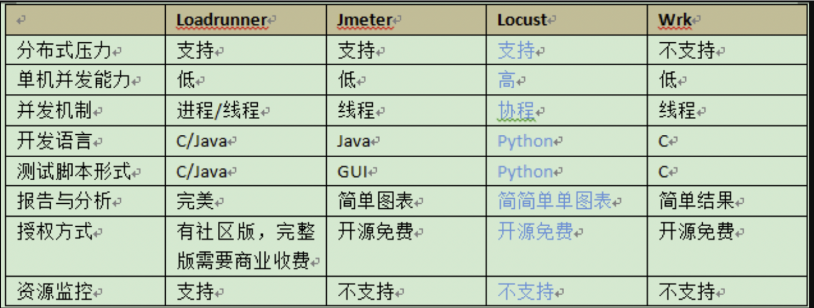

# 一、基础概念
1. **单机的并发数：2-4k/秒，qps查询率1-2k/秒，平均响应时间2秒**
2. 参考文档：https://zhuanlan.zhihu.com/p/111914041

## 1. QPS-每秒查询率
1. QPS(Queries Per Second)是每秒查询率 ,是**一台服务器每秒能够相应的查询次数**，是对一个特定的查询服务器在规定时间内所处理流量多少的衡量标准, 即每秒的响应请求数，也即是最大吞吐能力。

## 2. TPS-事务数/秒
1. TPS Transactions Per Second 也就是事务数/秒。一个事务是指一个客户机向服务器发送请求然后服务器做出反应的过程。客户机在发送请求时开始计时，收到服务器响应后结束计时，以此来计算使用的时间和完成的事务个数。

## 3. QPS和TPS区别
1. Tps即每秒处理事务数，包括了
- 用户请求服务器
- 服务器自己的内部处理
- 服务器返回给用户
2. 这三个过程，每秒能够完成N个这三个过程，Tps也就是N。
3. Qps基本类似于Tps，但是不同的是，对于一个页面的一次访问，形成一个Tps；但一次页面请求，可能产生多次对服务器的请求，服务器对这些请求，就可计入“Qps”之中。
4. 例子：
> 例如：访问一个页面会请求服务器3次，一次放，产生一个“T”，产生3个“Q”
> 
> 例如：一个大胃王一秒能吃10个包子，一个女孩子0.1秒能吃1个包子，那么他们是不是一样的呢？答案是否定的，因为这个女孩子不可能在一秒钟吃下10个包子，她可能要吃很久。这个时候这个大胃王就相当于TPS，而这个女孩子则是QPS。虽然很相似，但其实是不同的。

## 4. 并发数
1. 并发数（并发度）：指系统同时能处理的请求数量，同样反应了系统的负载能力。这个数值可以分析机器1s内的访问日志数量来得到。

## 5. 吞吐量
1. 吞吐量是指系统在单位时间内处理请求的数量，TPS、QPS都是吞吐量的常用量化指标。
2. **系统吞吐量要素**
- 一个系统的吞吐量（承压能力）与request（请求）对cpu的消耗，外部接口，IO等等紧密关联。
- 单个request 对cpu消耗越高，外部系统接口，IO影响速度越慢，系统吞吐能力越低，反之越高。
3. **重要参数**
**包括(QPS(TPS),并发数，响应时间)**
- QPS(TPS)：每秒钟request/事务 数量
- 并发数：系统同时处理的request/事务数
- 响应时间：一般取平均响应时间
4. 关系：**QPS(TPS)=并发数/平均响应时间**
5. 一个系统吞吐量通常有QPS(TPS),并发数两个因素决定，每套系统这个两个值都有一个相对极限值，在应用场景访问压力下，只要某一项达到系统最高值，系统吞吐量就上不去了，如果压力继续增大，系统的吞吐量反而会下降，原因是系统超负荷工作，上下文切换，内存等等其他消耗导致系统性能下降。

## 6. PV-页面访问量
1. PV（Page View）：页面访问量，即页面浏览量或点击量，用户每次刷新即被计算一次。可以统计服务一天的访问日志得到。

## 7. UV-一天内每个用户的访问量
1. UV（Unique Visitor）：独立访客，统计1天内访问某站点的用户数。可以统计服务一天的访问日志并根据用户的唯一标识去重得到。
2. 响应时间（RT）：响应时间是指系统对请求作出响应的时间，一般取平均响应时间。可以通过Nginx、Apache之类的Web Server得到。

## 8. DAU-日活跃用户数量
1. DAU(Daily Active User)，日活跃用户数量。常用于反映网站、互联网应用或网络游戏的运营情况。DAU通常统计一日（统计日）之内，登录或使用了某个产品的用户数（去除重复登录的用户），与UV概念相似

## 9. MAU-月活
1. MAU(Month Active User)：月活跃用户数量，指网站、app等去重后的月活跃用户数量

## 10. 系统吞吐量评估
1. 我们在做系统设计的时候就需要考虑CPU运算，IO，外部系统响应因素造成的影响以及对系统性能的初步预估。
2. 而通常情况下，我们面对需求，我们评估出来的出来QPS，并发数之外，还有另外一个维度：日pv。
3. 其次，我们站在管理员的角度考虑需要关注的性能点。
- 响应时间
- 服务器资源使用情况是否合理
- 应用服务器和数据库资源使用是否合理
- 系统能否实现扩展
- 系统最多支持多少用户访问、系统最大业务处理量是多少
- 系统性能可能存在的瓶颈在哪里
- 更换那些设备可以提高性能
- 系统能否支持7×24小时的业务访问
4. 站在开发（设计）人员角度去考虑。
- 1、 架构设计是否合理
- 2、 数据库设计是否合理
- 3、 代码是否存在性能方面的问题
- 4、 系统中是否有不合理的内存使用方式
- 5、 系统中是否存在不合理的线程同步方式
- 6、 系统中是否存在不合理的资源竞争

# 二、py性能测试工具
1. **Locust**（俗称 蝗虫）, 一个轻量级的开源压测工具，用Python编写
2. 几个压测工具对比：

3. locust是一个易于使用的，**分布式的**，用户负载测试工具。用于web站点（或其他系统）的负载测试，然后算出系统能够处理多少**并发用户**。
4. **locust完全是事件驱动的，因此它能够在单机支持数以千计的并发用户，使用gevent来编写的协程调用方式。**

# 三、如何提升系统的并发能力
1. 互联网分布式架构设计，提高系统并发能力的方式，方法论上主要有两种：`垂直扩展（Scale Up）`与`水平扩展（Scale Out）`。

2. 垂直扩展：提升单机处理能力。垂直扩展的方式又有两种：
- （1）增强单机硬件性能，例如：增加CPU核数如32核，升级更好的网卡如万兆，升级更好的硬盘如SSD，扩充硬盘容量如2T，扩充系统内存如128G；
- （2）提升单机架构性能，例如：使用Cache来减少IO次数，使用异步来增加单服务吞吐量，使用无锁数据结构来减少响应时间； 
3. 在互联网业务发展非常迅猛的早期，如果预算不是问题，强烈建议使用“增强单机硬件性能”的方式提升系统并发能力，因为这个阶段，公司的战略往往是发展业务抢时间，而“增强单机硬件性能”往往是最快的方法。
4. 不管是提升单机硬件性能，还是提升单机架构性能，都有一个致命的不足：单机性能总是有极限的。所以**互联网分布式架构设计高并发终极解决方案还是水平扩展。**

5. 水平扩展：只要增加服务器数量，就能线性扩充系统性能。水平扩展对系统架构设计是有要求的，如何在架构各层进行可水平扩展的设计，以及互联网公司架构各层常见的水平扩展实践，是本文重点讨论的内容。

## 1. python解决高并发的几种方式
1. HTML页面静态化
2. 图片服务器分离（如使用fastdfs轻量级的分布式文件存储系统）
3. 使用缓存（如redis或memcache）
4. 数据库集群、分库分表
5. 使用负载均衡的方法（简单的配置可以用nginx来配置负载均衡，只需要设置 如下代码，即可实现简单的负载均衡

```bash
# nginx负载均衡配置，在http的配置项处
 upstream djangoserver {  
             server 192.168.72.49:8080;  
             server 192.168.72.49:8081;  
          }
```

6. 镜像：镜像是大型网站常采用的提高性能和数据安全性的方式，镜像的技术可以解决不同网络接入商和地域带来的用户访问速度差异，比如ChinaNet和EduNet之间的差异就促使了很多网站在教育网内搭建镜像站点，数据进行定时更新或者实时更新。在镜像的细节技术方面，这里不阐述太深，有很多专业的现成的解决架构和产品可选。也有廉价的通过软件实现的思路，比如Linux上的rsync等工具。
7. CDN加速技术（内容分发网络）

# 四、常见的互联网分层架构
1. 常见的互联网分层架构：
- （1）客户端层：典型调用方是浏览器browser或者手机应用APP
- （2）反向代理层：系统入口，反向代理
- （3）站点应用层：实现核心应用逻辑，返回html或者json
- （4）服务层：如果实现了服务化，就有这一层
- （5）数据-缓存层：缓存加速访问存储
- （6）数据-数据库层：数据库固化数据存储

# 五、分层水平扩展架构实践

## 1. 反向代理层的水平扩展
1. 反向代理层的水平扩展，是通过“DNS轮询”实现的：dns-server对于一个域名配置了多个解析ip，每次DNS解析请求来访问dns-server，会轮询返回这些ip。
2. 当nginx成为瓶颈的时候，只要增加服务器数量，新增nginx服务的部署，增加一个外网ip，就能扩展反向代理层的性能，做到理论上的无限高并发。

## 2. 站点层的水平扩展
1. 站点层的水平扩展，是通过“nginx”实现的。通过修改nginx.conf，可以设置多个web后端。
2. 当web后端成为瓶颈的时候，只要增加服务器数量，新增web服务的部署，在nginx配置中配置上新的web后端，就能扩展站点层的性能，做到理论上的无限高并发。

## 3. 服务层的水平扩展
1. 服务层的水平扩展，是通过“服务连接池”实现的。
2. 站点层通过RPC-client调用下游的服务层RPC-server时，RPC-client中的连接池会建立与下游服务多个连接，当服务成为瓶颈的时候，只要增加服务器数量，新增服务部署，在RPC-client处建立新的下游服务连接，就能扩展服务层性能，做到理论上的无限高并发。如果需要优雅的进行服务层自动扩容，这里可能需要配置中心里服务自动发现功能的支持。

## 4. 数据层的水平扩展
1. 在数据量很大的情况下，数据层（缓存，数据库）涉及数据的水平扩展，将原本存储在一台服务器上的数据（缓存，数据库）水平拆分到不同服务器上去，以达到扩充系统性能的目的。
2. 互联网数据层常见的水平拆分方式有这么几种，以数据库为例：

### 1. `按照范围水平拆分`
1. 每一个数据服务，存储一定范围的数据，上图为例：
2. user0库，存储uid范围1-1kw
3. user1库，存储uid范围1kw-2kw
4. 这个方案的好处是：
- （1）规则简单，service只需判断一下uid范围就能路由到对应的存储服务；
- （2）数据均衡性较好；
- （3）比较容易扩展，可以随时加一个uid[2kw,3kw]的数据服务；
5. 不足是：
- 请求的负载不一定均衡，一般来说，新注册的用户会比老用户更活跃，大range的服务请求压力会更大；

### 2. `按照哈希水平拆分`
1. 每一个数据库，存储某个key值hash后的部分数据，上图为例：
2. user0库，存储偶数uid数据
3. user1库，存储奇数uid数据
4. 这个方案的好处是：
- （1）规则简单，service只需对uid进行hash能路由到对应的存储服务；
- （2）数据均衡性较好；
- （3）请求均匀性较好；
5. 不足是：
- 不容易扩展，扩展一个数据服务，hash方法改变时候，可能需要进行数据迁移；
6. 这里需要注意的是，通过水平拆分来扩充系统性能，与`主从同步读写分离`来扩充数据库性能的方式有本质的不同。
7. 通过水平拆分扩展数据库性能：
- （1）每个服务器上存储的数据量是总量的1/n，所以单机的性能也会有提升；
- （2）n个服务器上的数据没有交集，那个服务器上数据的并集是数据的全集；
- （3）数据水平拆分到了n个服务器上，理论上读性能扩充了n倍，写性能也扩充了n倍（其实远不止n倍，因为单机的数据量变为了原来的1/n）；
### 3. 通过`主从同步读写分离`扩展数据库性能：
- （1）每个服务器上存储的数据量是和总量相同；
- （2）n个服务器上的数据都一样，都是全集；
- （3）理论上读性能扩充了n倍，写仍然是单点，写性能不变；
9. 缓存层的水平拆分和数据库层的水平拆分类似，也是以范围拆分和哈希拆分的方式居多，就不再展开。
