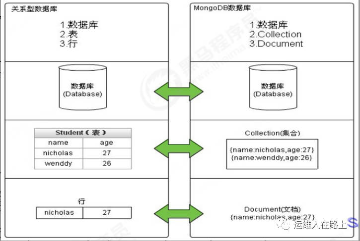

# 一、简介

1.  **MongoDB是一个开源、高性能、高可用的文档型数据库**，设计初衷就是用于简化开发和方便扩展，**是NoSql数据库中最像关系型数据库的非关系型数据库**
2.  **支持的数据结构是一种类似于`json`的格式叫`BSON`**，所以它既可以存储比较复杂的数据类型，又相当的灵活。
3.  MongoDB中的记录是一个文档，它是一个由**字段和值对（field\:value）组成**的数据结构。MongoDB文档类似于JSON对象，即一个文档认为就是一个对象。字段的数据类型是字符型，它的值除了使用基本的一些类型外，还可以包括其他文档、普通数组和文档数组。
4.  与mysql的对比



| Mysql       | MongoDB     | 说明                     |
| ----------- | ----------- | ---------------------- |
| database    | database    | 数据库                    |
| table       | collection  | 数据库表/集合                |
| row         | document    | 数据库记录行/文档              |
| colume      | field       | 数据字段/域                 |
| index       | index       | 索引                     |
| table joins |             | 表连接，mongo不支持           |
|             | 嵌入文档        | mongo通过嵌入式文档来替代多表连接    |
| primary key | primary key | 主键，mongo自动将\_id字段设置为主键 |

1.  mongo的最小存储单位是`文档(document)`,数据格式是`BSON`， 是一种类json的二进制存储格式，简称 `Binary JSON`,支持多种数据类型，可以有效的描述非结构化数据和结构化数据。这种格式的优点是灵活度高，缺点是空间利用率不高。
2.  业务场景：

*   数据量大
*   写入操作频繁（读写都很频繁）
*   价值较低的数据，对事务性要求不高

# 二、安装部署

```bash
# ubuntu上 
apt install mongodb
systemctl start mongodb
systemctl enable mongodb
```

# 三、Mongo基本操作

## 1. mongo shell

```bash
# 直接运行 mongo 命令进入mongo shell终端
mongo
# 列出数据库
> show dbs
# 切换/创建数据库(库不存在的时候会创建)
> use 数据库名称
# 查看当前正在使用的数据库
> db
# 删除数据库
> db.dropDatabase()
```

## 2. 集合操作

```bash
# 显式创建一个集合
> db.createCollection("my_collection")
# 隐式创建集合(通常使用隐式的)，当向一个集合中插入一个文档的时候，如果集合不存在，则会自动创建集合
> db.my_collection.insert({name: 'zk', age: NumberInt(18), date: new Date()})
# 集合删除
> db.my_collection.drop()
```

## 3. 文档操作

### 1. 文档插入

```bash
# 单个文档插入
> db.my_collection.insert({name: 'zk', age: NumberInt(18), date: new Date(), state: null})
```

1.  提示：

*   my\_collection集合不存在，则会隐式创建
*   mongo中的数字，默认情况下是double类型，如果要存整型，必须使用`函数NumberInt(整型数字)`
    ，否则取出来就有问题了。
*   插入当前日期使用 `new Date()`
*   插入的数据没有指定 `_id`
    ，会自动生成主键值
*   如果某字段没值，可以赋值为null，或不写该字段

```bash
# 文档批量插入
db.my_collection.insertMany([{name: 'zk02'}, {age:NumberInt(17)}])
```

1.  批量插入时，如果某条数据插入失败，将会终止插入，但已经插入成功的数据不会回滚掉。

### 2. 文档查询

1.  语法： **db.collection\_name.find(\<quert>, \[projection])**
2.  要格式化打印结果，可以将`.pretty()`添加到操作中

```bash
# 查询所有
> db.my_collection.find()
> db.my_collection.find({})
# 条件查询
> db.my_collection.find({name:'zk'})
# 查询出第一条数据
> db.my_collection.findOne({name:'zk'})
# 投影查询，不显示所有字段，只显示指定的字段
# 查询所有，只显示name字段
> db.my_collection.find({name:1})
# 查询结果只显示age,不显示_id
> db.my_collection.find({name:'zk'}, {_id:0, age:1})
```

### 3. 文档更新

1.  覆盖修改，会将之前的文档给覆盖了

```bash
# 覆盖修改
> db.my_collection.find({name:'zk'})
{ "_id" : ObjectId("6322f4a3c178ed179bb3b89f"), "name" : "zk", "age" : 18, "date" : ISODate("2022-09-15T09:47:15.413Z"), "state" : null }
> db.my_collection.update({name:'zk'}, {age: NumberInt(19),name:'zk'})
> db.my_collection.find({name:'zk'})
{ "_id" : ObjectId("6322f4a3c178ed179bb3b89f"), "age" : 19, "name" : "zk" }
```

1.  局部修改，需要使用修改器`$set`来实现

```bash
> db.my_collection.find({name:'zk'})
{ "_id" : ObjectId("6322f4a3c178ed179bb3b89f"), "age" : 19, "name" : "zk" }
# 只更新age为20，其余字段不变
> db.my_collection.update({name:'zk'},{$set:{age: NumberInt(20)}})
> db.my_collection.find({name:'zk'})
{ "_id" : ObjectId("6322f4a3c178ed179bb3b89f"), "age" : 20, "name" : "zk" }
```

1.  **批量修改,update方法默认只修改第一条数据，后边跟参数`{multi:true}`可全部修改**

```bash
# 默认只修改第一条数据
> db.comment.update({userid:"1003"},{$set:{nickname:"凯撒2"}}) 
# 修改所有符合条件的数据 
> db.comment.update({userid:"1003"},{$set:{nickname:"凯撒大帝"}},{multi:true})
```

1.  列值增长修改,想实现对某列值在原有值的基础上进行增加或减少，可以使用 `$inc`
    运算符来实现

```bash
# 对3号数据的点赞数，每次递增1
> db.comment.update({_id:"3"},{$inc:{likenum:NumberInt(1)}})
```

### 4. 文档删除

1.  删除语法：**db.集合名称.remove(条件)**

```bash
# 全部删除
> db.my_comment.remove({})
# 部分删除
> db.my_comment.remove({name:"zk"})
```

### 5. 文档复杂查询

1.  **统计查询**

```bash
> db.my_collection.count()
3
> db.my_collection.count({name:'zk'})
```

1.  **分页列表查询**，`limit()`来读取指定数量的数据,使用`skip()`方法来跳过指定数量的数据

```bash
# 返回指定条数的记录，可以在find方法后调用limit来返回结果(TopN)，默认值20,取前三个
> db.comment.find().limit(3)
# skip方法同样接受一个数字参数作为跳过的记录条数。（前N个不要）,默认值是0
> db.comment.find().skip(3)
# 分页查询需求：每页2个，第二页开始：跳过前两条数据，接着值显示3和4条数据
# 第一页
> db.comment.find().skip(0).limit(2)
{_id:1}
{_id:2}
# 第二页
> db.comment.find().skip(2).limit(2)
{_id:3}
{_id:4}
# 第三页
> db.comment.find().skip(4).limit(2)
{_id:5}
{_id:6}
```

1.  **排序`sort()`**

*   sort() 方法可以通过参数指定排序的字段，并使用 1 和 -1 来指定排序的方式，其中 1 为升序排列，而 -1 是用于降序排列

```bash
# 对userid降序排列，并对访问量进行升序排列
> db.comment.find({},{userid:1,likenum:1}).sort({userid:-1,likenum:1})
```

*   注意：**skip(), limilt(), sort()三个放在一起执行的时候，执行的顺序是先 sort(), 然后是 skip()，最后是显示的 limit()，和命令编写顺序无关**

1.  **正则查询**

```bash
# 模糊搜索，正则表达式
db.collection.find({field:/正则表达式/})
db.集合.find({字段:/正则表达式/})
# 搜索name中包含zk的所有文档
> db.my_collection.find({name:/zk/})
# 搜索name中以zk开头的所有文档
> db.my_collection.find({name:/^zk/})
```

1.  **比较查询**

*   **`$gt 大于；$`gte 大于等于；`$lt 小于；$`lte 小于等于；\$ne 不等于**

```bash
# 大于: field > value 
db.集合名称.find({ "field" : { $gt: value }})
```

1.  **包含查询**

*   使用`$in`和用`$nin`

```bash
> db.my_collection.find({name:{$in:['asd','zk01']}})
{ "_id" : ObjectId("632443aa5eb792083647d9af"), "name" : "zk01" }
{ "_id" : ObjectId("632443aa5eb792083647d9b0"), "name" : "asd" }
```

1.  **条件连接查询**

*   `$and:[ { },{ },{ } ]`
*   `$or:[ { },{ },{ } ]`

```bash
> db.comment.find({$and:[{likenum:{$gte:NumberInt(700)}},{likenum:{$lt:NumberInt(2000)}}]})

# 查询评论集合中userid为1003，或者点赞数小于1000的文档记录
> db.comment.find({$or:[ {userid:"1003"} ,{likenum:{$lt:1000} }]})
```

# 四、MongoDB索引

## 1. 索引概述

1.  索引是特殊的数据结构，它以易于遍历的形式存储集合数据集的一小部分。索引存储特定字段或一组字段的值，按字段值排序。索引项的排序支持有效的相等匹配和基于范围的查询操作。此外，MongoDB还可以使用索引中的排序返回排序结果。**MongDB中索引使用B-Tree数据结构，Mysql是B+Tree。**

## 2. 索引类型

1.  `单字段索引`：MongoDB支持在文档的单个字段上创建用户定义的升序/降序索引，称为单字段索引（Single Field Index）
2.  `复合索引`: MongoDB还支持多个字段的用户定义索引，即复合索引（Compound Index）

*   如果复合索引由 { userid: 1, score: -1 } 组成
*   则索引首先按userid正序排序，然后在每个userid的值内，再在按score倒序排序

1.  `地理空间索引`: 为了支持对地理空间坐标数据的有效查询，MongoDB提供了两种特殊的索引：返回结果时使用平面几何的二维索引和返回结果时使用球面几何的二维球面索引。
2.  `文本索引`：MongoDB提供了一种文本索引类型，支持在集合中搜索字符串内容。这些文本索引不存储特定于语言的停止词（例如“the”、“a”、“or”），而将集合中的词作为词干，只存储根词。
3.  `哈希索引`：为了支持基于散列的分片，MongoDB提供了散列索引类型，它对字段值的散列进行索引。这些索引在其范围内的值分布更加随机，但只支持相等匹配，不支持基于范围的查询

## 3. 索引的管理

### 1. 查看

1.  返回一个集合中所有索引的数组

```bash
> db.my_collection.getIndexes()
```

1.  **默认\_id索引**：MongoDB在创建集合的过程中，在 `_id 字段上创建一个唯一的索引，默认名字为 _id_`
    ，该索引可防止客户端插入两个具有相同值的文档，您不能在\_id字段上删除此索引

### 2. 创建

1.  创建单索引：db.comment.createIndex({userid:1})
2.  创建复合索引

```bash
# 复合索引：对 userid 和 nickname 同时建立复合（Compound）索引
> db.comment.createIndex({userid:1,nickname:-1})
```

### 3. 删除索引: `dropIndex`

1.  提示：\_id的字段的索引是无法删除的，只能删除非 \_id 字段的索引

```bash
# 删除 comment 集合中 userid 字段上的升序索引
> db.comment.dropIndex({userid:1})
{ "nIndexesWas" : 3, "ok" : 1 }
# 根据索引名称删除
> db.comment.dropIndex("userid_1_nickname_-1")
# 删除所有的索引
> db.collection.dropIndexes()
```

### 4. 索引执行计划

1.  分析查询性能（Analyze Query Performance
    ）通常使用执行计划来查看查询的情况，如查询耗费的时间、是否基于索引查询等
2.  单索引执行计划

```bash
# 查看根据userid查询数据的情况
> db.comment.find({userid:"1003"}).explain()
```

1.  **覆盖的查询：当查询条件和查询的投影仅包含索引字段时，MongoDB直接从索引返回结果，而不扫描任何文档或将文档带入内存。这些覆盖的查询可以非常有效**

```bash
> db.my_collection.find({age:{$gt: 16}}, {age:1,_id:0})
```
# 五、聚合查询
1. MongoDB 中聚合(aggregate)主要用于处理数据(诸如统计平均值，求和等)，并返回计算后的数据结果，使用方法：`aggregate()`\
2. 聚合表达式
- `$sum	计算总和`。	db.mycol.aggregate([{$group : {_id : "$by_user", num_tutorial : {$sum : "$likes"}}}])
- `$avg	计算平均值`
- `$min	获取集合中所有文档对应值得最小值。`
- `$max	获取集合中所有文档对应值得最大值`
3. 管道操作符
- `$project`：修改输出文档的结构。可以用来重命名、增加或删除域，也可以用于创建计算结果以及嵌套文档。
- `$match`：用于过滤数据，只输出符合条件的文档。$match使用MongoDB的标准查询操作。
- `$limit`：用来限制MongoDB聚合管道返回的文档数。
- `$skip`：在聚合管道中跳过指定数量的文档，并返回余下的文档。
- `$unwind`：将文档中的某一个数组类型字段拆分成多条，每条包含数组中的一个值。
- `$group`：将集合中的文档分组，可用于统计结果。
- `$sort`：将输入文档排序后输出。
- `$lookup`: 联表查询
- `$geoNear`：输出接近某一地理位置的有序文档。
```bash
# 只显示输出age,name字段信息
> db.my_collection.aggregate({$project: {age: 1, name: 1, _id:0}})
{ "name" : "zk02" }
{ "age" : 17 }
{ "age" : 15 }
{ "age" : 20 }
{ "name" : "zk01" }
{ "name" : "asd" }
```
