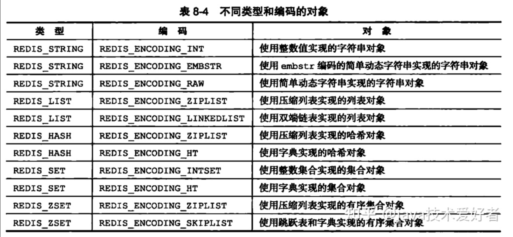
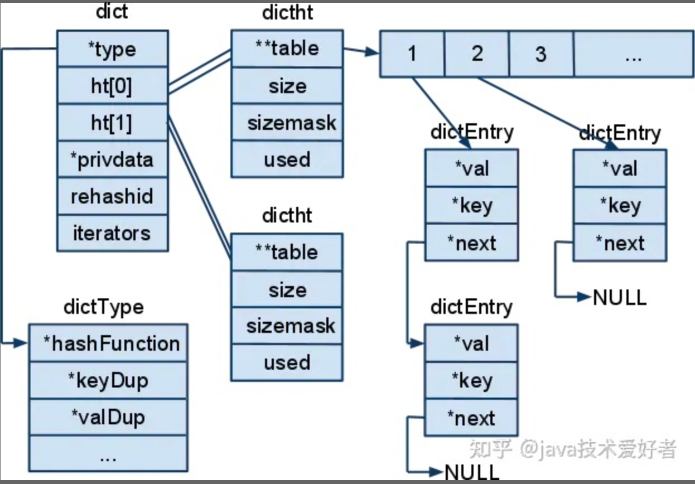
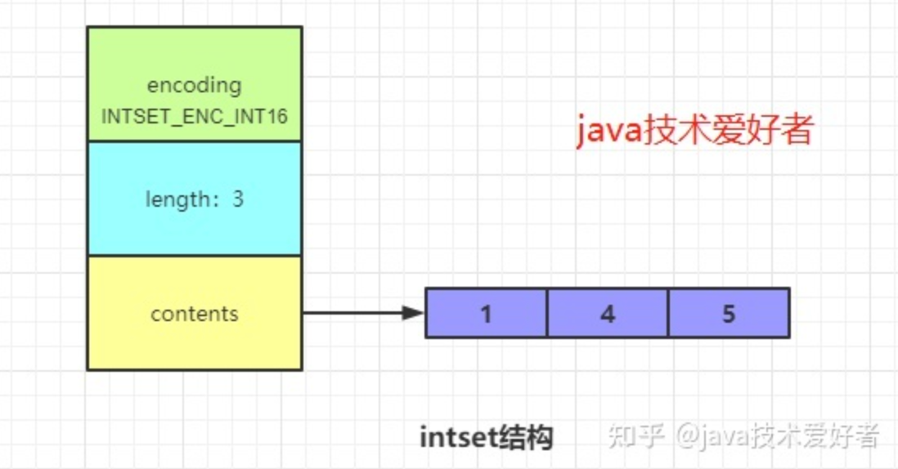
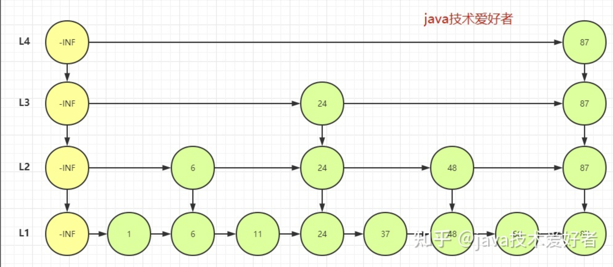

# 一、Redis概述 
- 非关系型数据库，是一种高性能的内存型k-v数据库
- **redis单线程，可以充当分布式锁**
- 支持数据持久化，将内存中的数据保存在磁盘中
- 支持k-v数据，value支持的数据类型为str、list，set，zset（有序集合），hash等数据结构的存储
- Redis支持数据的备份，即master-slave模式的数据备份
- Redis中默认有**16384**个哈希槽
- **一致性哈希**：为了解决分布式存储结构下动态增加和删除节点所带来的问题。
- **默认端口6379**

# 二、Py中使用Redis
1. 首先 pip install redis
2. redis提供两个类Redis和**StrictRedis**用于实现Redis的命令，StrictRedis用于实现大部分官方的命令，**一般使用StrictRedis较多**
3. redis-py使用**connection pool**来管理对一个redis server的所有连接，避免每次建立、释放连接的开销。默认，每个Redis实例都会维护一个自己的连接池。
可以直接建立一个**连接池**，然后作为参数Redis，这样就可以实现多个Redis实例共享一个连接池

```python
pool = redis.ConnectionPool(host='localhost', port=6379, db=2, password= ###,decode_responses=True)
Redis = redis.StrictRedis(connection_pool=pool)
app.redis = Redis
```

5. **管道(pipeline**),redis默认执行每次请求时，都会创建和断开连接池操作，一次请求中指定多个命令，则可以**使用pipline实现一次请求指定多个命令，且是原子性操作**，完整代码如下：

```python
import redis
import time

pool = redis.ConnectionPool(host='localhost', port=6379, decode_responses=True)
r = redis.StrictRedis(connection_pool=pool)
pipe = r.pipeline() # 创建一个管道

pipe.set('name', 'jack')
pipe.set('role', 'sb')
pipe.sadd('faz', 'baz')
pipe.incr('num')    # 如果num不存在则vaule为1，如果存在，则value自增1
pipe.execute()

print(r.get("name"))
print(r.get("role"))
print(r.get("num"))
```

6. **pipe.execute()**， 类似于git commit提交命令
管道的命令可以写在一起，如：
pipe.set('hello', 'redis').sadd('faz', 'baz').incr('num').execute()
7. **r.flushdb()**        # 清空某个db中的所有数据
8. **r.flushall()**        # 清空redis所有库中的所有数据

# 三、Redis操作及支持的数据类型
**redis支持的命令参考：http://redisdoc.com/index.html**

## 1. redis自带的通用操作
- 删除，r.**delete**("gender")  # 删除key为gender的键值对
- 检查名字是否存在，**exists(name)**，

```python
# 存在就是True，False 不存在
r.exists("zset1"))
```

- 模糊匹配，**keys**(pattern='')
根据模型获取redis的name

```python
# 获取所有的键
r.keys()
# 模糊匹配
r.keys("foo*")
```

- 设置超时时间，expire(name ,time)
- 获取类型，type(name)

## 2. String CRUD均支持
1. 增加，修改 set key value；
获取 get key；删除 del key；批量设置 mset({k1:value1,k2:value2})

```bash
incr key  -> 自增数字,每次加一，常用于计数器

```

## 3. hash  值为{} 字典类型的，CRUD均支持
1. 修改（没有就新增）hset()

```python
r.hset("hash1", "k1", "v1")
```

2. 批量设置hmset()

```python
r.hmset("hash2", {"k2": "v2", "k3": "v3"})
```

3. 取出，获取，hget(),hmget(),hmgetall('hash1')
4. 获取name对应的hash中键值对的个数

```python
r.hlen("hash1"))
```

5. 删除 hdel(name1, k1)

```bash
HINCRBY key field increment
# 为哈希表 key 中的域 field 的值加上增量 increment 。
# 增量也可以为负数，相当于对给定域进行减法操作。
```

## 4、list CRUD均支持
1. **lpush**(name,value),**从左边插入**

```python
r.lpush("list1", 11, 22, 33)
# 输出结果为
# 33,22,11
```

2. **rpush**(name, value), **从右边新增**

```python
r.rpush("list2", 44, 55, 66)
# 输出结果为
# 44，55，66
```

3. linsert(name, where, refvalue, value))， 固定索引号位置插入元素

```python
r.linsert("list2", "before", "11", "00")   # 往列表中左边第一个出现的元素"11"前插入元素"00"
print(r.lrange("list2", 0, -1))   # 切片取出值，范围是索引号0-最后一个元素
```

4. **修改， r.lset**(name, index, value)，指定索引号进行修改

```python
r.lset("list2", 0, -11)    # 把索引号是0的元素修改成-11
```

5. **删除，r.lrem**(name, value, num)
6. lpop(name)，在name对应的列表的左侧获取第一个元素并在列表中移除，返回值则是第一个元素
7. lindex(name, index)， 根据索引取值

## 5. set 无序集合 增、删、查，无修改操作
1. 新增 sadd("set1", 33, 44, 55, 66)
2. 个数 scard(name)
获取name对应的集合中元素个数
3. 差集
sdiff(keys, *args)

```python
r.sdiff("set1", "set2"))   # 在集合set1但是不在集合set2中
```

4. 交集，sinter(keys, *args)
获取多一个name对应集合的交集

```python
r.sinter("set1", "set2")) # 取2个集合的交集
```

5. 并集，sunion(keys, *args)
获取多个name对应的集合的并集

```python
r.sunion("set1", "set2")) # 取2个集合的并集
```

6. 删除， spop(name)
从集合移除一个成员，并将其返回,说明一下，集合是无序的，所有是随机删除的
7. srem(name, values)
在name对应的集合中删除某些值

## 6. zset 有序集合，每个元素关联一个权重；增、删、查，**无修改操作**
1. 新增，zadd()

```python
r.zadd("zset1", n1=11, n2=22)
r.zadd("zset2", 'm1', 22, 'm2', 44)
```

2. zscan(),获取所有元素--默认按照分数顺序排序

```python
r.zscan("zset3")
```

3. 删除，zrem(name, values)

```python
r.zrem("zset3", "n3")   # 删除有序集合中的元素n3 删除单个
```

# 四、Redis客户端工具

#### 4.1 redis-cli
1. **redis-cli -h 192.168.210.61 -p 17009 -a aaaaaa**   -> 进入redis客户端

```bash
# 进入redis_client
redis-cli -h 192.168.210.62 -p 17009 -a cmErx8YISO080eJtel5ZSgyMz5DScuVvb1rjLsgu
192.168.210.62:17009> info  # 查看信息
192.168.210.62:17009> KEYS * # 列出所有的key
192.168.210.62:17009> select 0 # 切换到0号库上
redis-cli -c -p 6371  # -c 连接集群
```

# 五、redis分布式锁
1. **使用SETEX，用法SETEX key seconds value**

```python
192.168.210.62:17009> set lock 5 yalezhang_01 # 设置lock建5秒钟，value是yalezhang_01
```
2. 释放：**分布式锁必须由锁的持有者自己释放，所以我们必须先确保当前释放锁的线程是持有者，没问题了再删除，使用lua脚本**
2. 


# 六、Redis主从分离（读、写分离）
1. pass

# 七、哨兵模式（sentinel）

## 1. 前言
1. redis的主从复制模式下，一旦主节点故障，需要手动将从节点晋升为主节点，还要通知客户端更新主节点地址。
2. redis 2.8以后提供了redis sentinel哨兵模式

## 2. redis高可用概述
1. 在 Web 服务器中，高可用 是指服务器可以 正常访问 的时间，衡量的标准是在 多长时间 内可以提供正常服务（99.9%、99.99%、99.999% 等等）。
2. 在 Redis 层面，高可用 的含义要宽泛一些，除了保证提供 正常服务（如 主从分离、快速容灾技术 等），还需要考虑 数据容量扩展、数据安全 等等。
3. **在 Redis 中，实现 高可用 的技术主要包括 持久化、复制、哨兵 和 集群**，下面简单说明它们的作用，以及解决了什么样的问题：

- 持久化：持久化是 最简单的 高可用方法。它的主要作用是 数据备份，即将数据存储在 硬盘，保证数据不会因进程退出而丢失。
- 复制：复制是高可用 Redis 的基础，哨兵 和 集群 都是在 复制基础 上实现高可用的。**复制主要实现了数据的多机备份以及对于读操作的负载均衡和简单的故障恢复**。缺陷是故障恢复无法自动化、写操作无法负载均衡、存储能力受到单机的限制。
- 哨兵：在复制的基础上，**哨兵实现了 自动化 的 故障恢复**。**缺陷是 写操作 无法 负载均衡，存储能力 受到 单机 的限制。**
- 集群：通过集群，Redis 解决了 写操作 无法 负载均衡 以及 存储能力 受到 单机限制 的问题，实现了较为 完善 的 高可用方案。

## 3. Redis Sentinel的基本概念
1. Redis Sentinel 是 Redis 高可用 的实现方案。Sentinel 是一个管理多个 Redis 实例的工具，它可以实现对 Redis 的 监控、通知、自动故障转移。
2. redis节点: 主节点、从节点
3. Sentinel节点、redis客户端


## 4. Redis Sentinel深入探究
1. Sentinel 的主要功能包括 **主节点存活检测、主从运行情况检测、自动故障转移 （failover）、主从切换**。Redis 的 Sentinel 最小配置是 一主一从。
2. Redis 的 Sentinel 系统可以用来管理多个 Redis 服务器，该系统可以执行以下四个任务：
- **监控**: Sentinel 会不断的检查 主服务器 和 从服务器 是否正常运行。
- **通知**:当被监控的某个 Redis 服务器出现问题，Sentinel 通过 API 脚本 向 管理员 或者其他的 应用程序 发送通知
- **自动故障转移:当 主节点 不能正常工作时，Sentinel 会开始一次 自动的 故障转移操作，它会将其中一个 从节点 升级为新的 主节点，并且将其他的 从节点 指向 新的主节点。**

### 4.1 主观下线和客观下线
1. 默认情况下，每个 Sentinel 节点会以 每秒一次 的频率对 Redis 节点和 其它 的 Sentinel 节点发送 PING 命令，并通过节点的 回复 来判断节点是否在线。
2. **主观下线适用于所有 主节点 和 从节点**。如果在 down-after-milliseconds 毫秒内，Sentinel 没有收到 目标节点 的有效回复，则会判定 该节点 为 主观下线
3. **客观下线 只适用于 主节点**。如果 主节点 出现故障，Sentinel 节点会通过 sentinel is-master-down-by-addr 命令，向其它 Sentinel 节点询问对该节点的 状态判断。如果超过 `设定的某个数` 的节点判定 主节点 不可达，则**该 Sentinel 节点会判断 主节点 为 客观下线**。

### 4.2 Redis Sentinel的工作原理
1. **每个 Sentinel 节点都需要 定期执行 以下任务**：
- 对其他服务进行心跳检测：每个 Sentinel 以 每秒钟 一次的频率，向它所知的 主服务器、从服务器 以及其他 Sentinel 实例 发送一个 PING 命令。

- 如果一个 实例（instance）距离 最后一次 有效回复 PING 命令的时间超过 down-after-milliseconds 所指定的值，那么这个实例会被 Sentinel 标记为 **主观下线**

## 5. Redis Sentinel搭建
1. 一个稳健的 Redis Sentinel 集群，应该使用**至少 三个 Sentinel 实例**，并且保证讲这些实例放到 不同的机器 上，甚至不同的 物理区域
2. Sentinel 无法保证 强一致性。

# 八、缓存穿透、击穿、雪崩

### 1. 穿透
1. **穿透：大量查询不到的数据的请求落到后端数据库，数据库压力增大。**
2. 由于大量缓存查不到就去数据库去取，数据库也没有数据。
3. **解决：对于没查到返回为None的数据也缓存，只不过设置很短的过期时间**。删除数据的时候删除相应缓存，或者设置较短的超时时间。
4. 解决：最常见的则是采用**布隆过滤器**，将所有可能存在的数据哈希到一个足够大的bitmap中，一个一定不存在的数据会被 这个bitmap拦截掉，从而避免了对底层存储系统的查询压力。

### 2. 击穿
1. **某些非常热点的数据key过期，大量请求打到后端数据库。** 如某一时间微博热点数据
2. 解决：**分布式锁：获取锁的线程从DB拉数据更新缓存，其他线程等待。**
3. 解决：**异步后台更新：后台任务针对过期的key自动刷新。**

### 3. 雪崩
1. **缓存不可用或大量缓存key同时失效，大量请求直接打到数据库。DB瞬时压力过重雪崩**
2. 解决：**设置多级缓存，不同级别的key设置不同的超时时间。**
3. **随机超时：key的超时时间随机设置，防止同时超时。**

# 九、redis持久化
- **RDB持久化（将Reids在内存中的数据库记录定时dump到磁盘上）：在指定的时间间隔内将内存中的数据集快照写入磁盘，实际操作过程是fork一个子进程，先将数据集写入临时文件，写入成功后，再替换之前的文件，用二进制压缩存储**
- **AOF（append only file）持久化（将Reids的操作日志以追加的方式写入文件)：以日志的形式记录服务器所处理的每一个写、删除操作，查询操作不会记录，以文本的方式记录，可以打开文件看到详细的操作记录。**

## 1. 二者优缺点
**备份、性能、效率高一些，数据可能会不完整，用RDB;
更高的数据缓存一致性、性能低一些，用AOF;**

###### RDB存在哪些优势呢？
1. 持久化后，整个Redis数据库将只包含一个文件，**文件备份很方便**。比如，你可能打算每个小时归档一次最近24小时的数据，同时还要每天归档一次最近30天的数据。通过这样的备份策略，一旦系统出现灾难性故障，我们可以非常容易的进行恢复。
2. **对于灾难恢复而言，RDB是非常不错的选择**。因为我们可以非常轻松的将一个单独的文件压缩后再转移到其它存储介质上。
3. **性能最大化**。对于Redis的服务进程而言，在开始持久化时，它唯一需要做的只是fork出子进程，之后再由子进程完成这些持久化的工作，这样就可以极大的避免服务进程执行IO操作了。
4. 相比于AOF机制，**如果数据集很大**，RDB的**启动效率****会更高**。

###### RDB又存在哪些劣势呢？
1. **低可用性，可能会丢失数据**
1. 如果你想保证数据的高可用性，即最大限度的避免数据丢失，那么RDB将不是一个很好的选择。因为系统一旦在定时持久化之前出现宕机现象，此前没有来得及写入磁盘的数据都将丢失。
2. 由于RDB是通过fork子进程来协助完成数据持久化工作的，因此，如果当数据集较大时，可能会导致整个服务器停止服务几百毫秒，甚至是1秒钟。

###### AOF的优势有哪些呢？
1. 该机制可以带来**更高的数据安全性**，即**数据持久性**。Redis中提供了3中同步策略，即每秒同步、每修改同步和不同步。事实上，每秒同步也是异步完成的，其效率也是非常高的，所差的是一旦系统出现宕机现象，那么这一秒钟之内修改的数据将会丢失。而每修改同步，我们可以将其视为同步持久化，即每次发生的数据变化都会被立即记录到磁盘中。可以预见，这种方式在效率上是最低的。至于无同步，无需多言，我想大家都能正确的理解它。
2. 由于该机制对日志文件的写入操作采用的是append模式，因此在写入过程中**即使出现宕机**现象，**也不会破坏日志文件中已经存在的内容**。然而如果我们本次操作只是写入了一半数据就出现了系统崩溃问题，不用担心，在Redis下一次启动之前，我们**可以通过redis-check-aof工具**来帮助我们**解决数据一致性的问题**。
3. 如果日志过大，Redis可以**自动启用rewrite机制**。即Redis以append模式不断的将修改数据写入到老的磁盘文件中，同时Redis还会创建一个新的文件用于记录此期间有哪些修改命令被执行。因此在进行rewrite切换时可以更好的保证数据安全性。
4. AOF包含一个**格式清晰、易于理解的日志文件用于记录所有的修改操作**。事实上，我们也可以通过该文件完成数据的重建。

###### AOF的劣势有哪些呢？

1. **对于相同数量的数据集而言**，**AOF文件通常要大于RDB文件。RDB 在恢复大数据集时的速度比 AOF 的恢复速度要快。**

2. 根据同步策略的不同，**AOF**在**运行效率**上往往会**慢于RDB**。总之，每秒同步策略的效率是比较高的，同步禁用策略的效率和RDB一样高效。

##### 备份、性能、效率高一些，数据可能会不完整，用RDB;

##### 更高的数据缓存一致性、性能低一些，用AOF;

##### 常用配置
- RDB持久化配置
- Redis会将数据集的快照dump到dump.rdb文件中。此外，我们也可以通过配置文件来修改Redis服务器dump快照的频率，在打开6379.conf文件之后，我们搜索save，可以看到下面的配置信息：
1. save 900 1              #在900秒(15分钟)之后，如果至少有1个key发生变化，则dump内存快照。
2. save 300 10            #在300秒(5分钟)之后，如果至少有10个key发生变化，则dump内存快照。

3. save 60 10000        #在60秒(1分钟)之后，如果至少有10000个key发生变化，则dump内存快照。

- AOF持久化配置
- 在Redis的配置文件中存在三种同步方式，它们分别是：
1. appendfsync always     #每次有数据修改发生时都会写入AOF文件。
1. appendfsync everysec  #每秒钟同步一次，该策略为AOF的缺省策略。
1. appendfsync no          #从不同步。高效但是数据不会被持久化

# 十、redis内存占用多少合适
1. **极限情况**：留出一倍内存。比如你的redis数据占用了8G内存，那么你还需要再预留8G空闲内存。也就是内存需求是16G。**内存占用率低于50%是最安全的。**
2. **普通情况**：正常情况下，在序列化周期内，不会更改所有数据，只会有部分数据更改，那么，预留出可能产生的更改部分的空间，就行。如果实在要说一个数据的话，**内存占用率低于75%都是安全的。**
3. 通过配置文件**设置maxmemory**来实现

# 十一、Redis数据类型底层实现

## 1. Redis的数据结构
1. Redis的这些数据结构，在底层都是使用`redisObject`来进行表示。redisObject中有三个重要的属性，分别是`type、 encoding 和 ptr`。
2. type表示保存的value的类型。通常有以下几种，也就是常见的五种数据结构：
- 字符串 REDIS_STRING
- 列表 REDIS_LIST
- 集合 REDIS_SET
- 有序集合 REDIS_ZSET
- 字典 REDIS_HASH
3. encoding表示保存的value的编码，通常有以下几种：

```bash
#define REDIS_ENCODING_RAW 0            // 编码为字符串
#define REDIS_ENCODING_INT 1            // 编码为整数
#define REDIS_ENCODING_HT 2             // 编码为哈希表
#define REDIS_ENCODING_ZIPMAP 3         // 编码为 zipmap
#define REDIS_ENCODING_LINKEDLIST 4     // 编码为双端链表
#define REDIS_ENCODING_ZIPLIST 5        // 编码为压缩列表
#define REDIS_ENCODING_INTSET 6         // 编码为整数集合
#define REDIS_ENCODING_SKIPLIST 7       // 编码为跳跃表
```
4. ptr是一个指针，指向实际保存的value的数据结构。
5. *数据类型和编码方式是有一定关系的，所以数据类型和编码方式是可以确定底层采用什么数据结构存储数据的。*


## 2. string(字符串)
1. 字符串对象的 encoding 有三种，分别是：int、raw、embstr, 常用的命令有常用命令: set、get、decr、incr、mget 等。
2. 我们知道Redis是用C语言开发的，但是底层存储不是使用C语言的字符串类型，而是自己开发了一种数据类型`SDS`进行存储，SDS即Simple Dynamic String ，是一种`动态字符串`。我们可以在github找到源码。

```c
struct sdshdr{
 int len;/*字符串长度*/
 int free;/*未使用的字节长度*/
 char buf[];/*保存字符串的字节数组*/
}
```
3. SDS与C语言的字符串有什么区别呢?
- C语言获取字符串长度是从头到尾遍历，时间复杂度是O(n)，而**SDS有len属性记录字符串长度**，时间复杂度为O(1)。
- **避免缓冲区溢出**。SDS在需要修改时，会先检查空间是否满足大小，如果不满足，则先扩展至所需大小再进行修改操作。
- **空间预分配**。当SDS需要进行扩展时，Redis会为SDS分配好内存，并且根据特定的算法分配多余的free空间，避免了连续执行字符串添加带来的内存分配的消耗。
- **惰性释放**。如果需要缩短字符串，不会立即回收多余的内存空间，而是用free记录剩余的空间，以备下次扩展时使用，避免了再次分配内存的消耗。
- **二进制安全**。c语言在存储字符串时采用N+1的字符串数组，末尾使用'\0'标识字符串的结束，如果我们存储的字符串中间出现'\0'，那就会导致识别出错。而SDS因为记录了字符串的长度len，则没有这个问题。
4. 字符串类型的应用是非常广泛的，比如可以**把对象转成JSON字符串存储到Redis中作为缓存，也可以使用decr、incr命令用于计数器的实现，又或者是用setnx命令为基础实现分布式锁**等等。
5. 需要注意的是：Redis 规定了字符串的长度不得超过 *512 MB*。

## 3. hash(字典)
1. 哈希对象的编码有两种，分别是：**ziplist、hashtable**
2. 当哈希对象保存的键值对数量小于 512，并且所有键值对的长度都小于 64 字节时，使用ziplist(压缩列表)存储；否则使用 hashtable 存储。
3. Redis中的hashtable跟Java中的HashMap类似，都是通过"数组+链表"的实现方式解决部分的哈希冲突。直接看源码定义。

```c
typedf struct dict{
    dictType *type;//类型特定函数，包括一些自定义函数，这些函数使得key和value能够存储
    void *private;//私有数据
    dictht ht[2];//两张hash表 
    int rehashidx;//rehash索引，字典没有进行rehash时，此值为-1
    unsigned long iterators; //正在迭代的迭代器数量
}dict;

typedef struct dictht{
     //哈希表数组
     dictEntry **table;
     //哈希表大小
     unsigned long size;
     //哈希表大小掩码，用于计算索引值
     //总是等于 size-1
     unsigned long sizemask;
     //该哈希表已有节点的数量
     unsigned long used; 
}dictht;

typedf struct dictEntry{
    void *key;//键
    union{
        void val;
        unit64_t u64;
        int64_t s64;
        double d;
    }v;//值
    struct dictEntry *next；//指向下一个节点的指针
}dictEntry;
```


4. 下面讲一下扩容和收缩。当哈希表保存的键值太多或者太少时，就会通过rehash来进行相应的扩容和收缩。
*扩容和收缩的过程：*
> 1、如果执行扩展操作，会基于原哈希表创建一个大小等于 ht[0].used*2n 的哈希表（也就是每次扩展都是根据原哈希表已使用的空间扩大一倍创建另一个哈希表）。相反如果执行的是收缩操作，每次收缩是根据已使用空间缩小一倍创建一个新的哈希表。

> 2、重新利用哈希算法，计算索引值，然后将键值对放到新的哈希表位置上。

> 3、所有键值对都迁徙完毕后，释放原哈希表的内存空间。

5. **渐进式rehash**：当数据量非常大时，如果是几十万，几百万的键值要一次性进行rehash，势必会导致redis性能严重下降，自然而然地redis开发者就想到采用渐进式rehash。
6. 在rehash时，会使用rehashidx字段保存迁移的进度，rehashidx为0表示迁移开始。在迁移过程中ht[0]和ht[1]会同时保存数据，ht[0]指向旧哈希表，ht[1]指向新哈希表，每次对字典执行添加、删除、查找或者更新操作时，程序除了执行指定的操作以外，还会顺带将ht[0]的元素迁移到ht[1]中。
7. 随着字典操作的不断执行，最终会在某个时间节点，ht[0]的所有键值都会被迁移到ht[1]中，rehashidx设置为-1，代表迁移完成。如果没有执行字典操作，redis也会通过定时任务去判断rehash是否完成，没有完成则继续rehash。
8. rehash完成后，ht[0]指向的旧表会被释放, 之后会将新表的持有权转交给ht[0], 再重置ht[1]指向NULL。
9. `渐进式rehash的优缺点`：
- 优点是把rehash操作分散到每一个字典操作和定时函数上，避免了一次性集中式rehash带来的服务器压力。
- 缺点是在rehash期间需要使用两个hash表，占用内存稍大。
10. hash类型的常用命令有：`hget、hset、hgetall` 等。

## 4. list(链表)
1. 列表对象的编码有两种，分别是：ziplist、linkedlist。当列表的长度小于 512，并且所有元素的长度都小于 64 字节时，使用ziplist存储；否则使用 linkedlist(双端链表)存储。
2. Redis中的linkedlist类似于Java中的LinkedList，是一个链表，底层的实现原理也和LinkedList类似。这意味着list的插入和删除操作效率会比较快，时间复杂度是O(1)。
3. list类型常用的命令有：lpush、rpush、lpop、rpop、lrange等

## 5. set(集合)
1. set类型的特点很简单，无序，不重复，跟Java的HashSet类似。它的编码有两种，分别是intset和hashtable。如果value可以转成整数值，并且长度不超过512的话就使用intset存储，否则采用hashtable。
2. hashtable在前面讲hash类型时已经讲过，这里的set集合采用的hashtable几乎一样，只是哈希表的value都是NULL。这个不难理解，比如用Java中的HashMap实现一个HashSet，我们只用HashMap的key就是了。
3. 我们讲一讲intset：

```c
typedef struct intset{
    uint32_t encoding;//编码方式

    uint32_t length;//集合包含的元素数量

    int8_t contents[];//保存元素的数组
}intset;
```
4. encoding有三种，分别是INTSET_ENC_INT16、INSET_ENC_INT32、INSET_ENC_INT64，代表着整数值的取值范围。Redis会根据添加进来的元素的大小，选择不同的类型进行存储，可以尽可能地节省内存空间。
5. length记录集合有多少个元素，这样获取元素个数的时间复杂度就是O(1)。contents，存储数据的数组，数组按照从小到大有序排列，不包含任何重复项.

6. 如果一开始存的是INTSET_ENC_INT16(范围在-32,768~32,767)，如果这时添加了一个40000的数，怎么升级为INSET_ENC_INT32呢？升级过程是这样的：
- 根据新元素的类型扩展数组contents的空间。
- 从尾部将数据插入。
- 根据新的编码格式重置之前的值，因为这时的contents存在着两种编码的值。从插入的数据的位置，也就是尾部，从后到前将之前的数据按照新的编码格式进行移动和设置。从后到前调整是为了防止数据被覆盖。
7. 升级的优点在于，**根据存储的数据大小选择合适的编码方式，节省了内存**。
8. 缺点在于，**升级会消耗系统资源。而且升级是不可逆的，也就是一旦对数组进行升级，编码就会一直保持升级后的状态**。
9. set数据类型常用的命令有：sadd、spop、smembers、sunion等等。
10. Redis为set类型提供了求交集，并集，差集的操作，可以非常方便地实现譬如共同关注、共同爱好、共同好友等功能

## 6. zset(有序集合)
1. zset是Redis中比较有特色的数据类型，它和set一样是不可重复的，区别在于多了score值，用来代表排序的权重。也就是当你需要**一个有序的，不可重复的集合列表**时，就可以考虑使用这种数据类型。
2. zset的编码有两种，分别是：ziplist、skiplist。当zset的长度小于 128，并且所有元素的长度都小于 64 字节时，使用ziplist存储；否则使用 `skiplist(跳跃表) `存储。

3. 跳跃表的数据结构如上图所示，为什么要设计成这样呢？好处在于查询的时候，可以减少时间复杂度，如果是一个链表，我们要插入并且保持有序的话，那就要从头结点开始遍历，遍历到合适的位置然后插入，如果这样性能肯定是不理想的。
4. 所以问题的关键在于能不能像使用二分查找一样定位到插入的点，答案就是使用跳跃表。比如我们要插入38，那么查找的过程就是这样。
- 首先从L4层，查询87，需要查询1次。

- 然后到L3层，查询到在->24->87之间，需要查询2次。

- 然后到L2层，查询->48，需要查询1次。

- 然后到L1层，查询->37->48，查询2次。确定在37->48之间是插入点。

5. 有没有发现经过L4，L3，L2层的查询后已经跳过了很多节点，当到了L1层遍历时已经把范围缩小了很多。这就是跳跃表的优势。这种方式有点类似于二分查找，所以他的时间复杂度为**O(logN)**
6. 其实生活中也有这种例子，类似于快递填写的地址是省->市->区->镇->街，当快递公司在送快递时就根据地址层层缩小范围，最终锁定在一个很小的区域去搜索，提高了效率。
7. zet常用的命令有：zadd、zrange、zrem、zcard等。

8. `zset的特点非常适合应用于开发排行榜的功能，比如三天阅读排行榜，游戏排行榜等等。`
