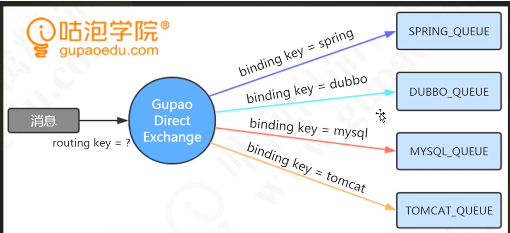

# 一、常见的消息队列(MQ)及应用场景？
- 主要的消息队列有：**RabbitMQ、Kafka、ZeroMQ，Redis也可以**
- **异步处理，应用解耦，流量削锋和消息通讯**
- 1 **异步处理**：引入消息队列，将不是必须的、耗时的业务逻辑，异步处理；如发邮件、发送短信
- 2 **应用解耦**：如订单系统将消息写入消息队列，返回用户下单成功，订单系统不再关心其他的后序操作了；而库存系统订阅下单的消息，采用拉/推的方式，获取下单信息，进行库存操作，实现订单系统与库存系统的应用解耦
- 3 **流量削峰**：秒杀，抢团活动中使用；将大量的用户请求写入消息队列，假如消息队列长度超过最大数量，则直接抛弃用户请求或跳转到错误页面，秒杀业务根据消息队列中的请求信息，再做后续处理
- 4 **消息通讯**：消息队列一般都内置了高效的通信机制，因此也可以用在纯的消息通讯。比如实现点对点消息队列，或者聊天室等

# 二、RabbitMQ VS Kafka

### 1. 应用场景方面
- RabbitMQ：用于**实时的，对可靠性要求较高**的消息传递上。
- kafka：用于处于活跃的**流式数据，大数据量**的数据处理上。

### 2. 架构模型方面
1. producer，broker，consumer
- RabbitMQ：以broker为中心，有消息的确认机制
- kafka：以consumer为中心，无消息的确认机制

### 3. 吞吐量方面
- RabbitMQ：支持消息的可靠的传递，支持事务，不支持批量操作，基于存储的可靠性的要求存储可以采用内存或硬盘，吞吐量小。
- kafka：内部采用消息的批量处理，数据的存储和获取是本地磁盘顺序批量操作，消息处理的效率高，吞吐量高。

### 4. 集群负载均衡方面
- RabbitMQ：本身不支持负载均衡，需要loadbalancer的支持
- kafka：采用zookeeper对集群中的broker，consumer进行管理，可以注册topic到zookeeper上，通过zookeeper的协调机制，producer保存对应的topic的broker信息，可以随机或者轮询发送到broker上，producer可以基于语义指定分片，消息发送到broker的某个分片上。

### 5. 总结
**RabbitMQ**
1. RabbitMQ的消息应当尽可能的小，并且只用来处理实时且要高可靠性的消息。
2. 消费者和生产者的能力尽量对等，否则消息堆积会严重影响RabbitMQ的性能。
3. 集群部署，使用热备，保证消息的可靠性。

**Kafka**
1. 应当有一个非常好的运维监控系统，不单单要监控Kafka本身，还要监控Zookeeper。(kafka强烈的依赖于zookeeper,如果zookeeper挂掉了，那么Kafka也不行了)
2. 对消息顺序不依赖，且不是那么实时的系统。
3.对消息丢失并不那么敏感的系统。
4.从 A 到 B 的流传输，无需复杂的路由，最大吞吐量可达每秒 100k 以上。

# 三、rabbitmq

## 1. 概念
- Broker： 简单来说就是消息队列服务器实体
- Exchange： 消息交换机，它指定消息按什么规则，路由到哪个队列
- Queue： 消息队列载体，每个消息都会被投入到一个或多个队列
- Binding： 绑定，它的作用就是把exchange和queue按照路由规则绑定起来
- Routing Key： 路由关键字，exchange根据这个关键字进行消息投递
- VHost： vhost 可以理解为虚拟 broker ，即 mini-RabbitMQ server。其内部均含有独立的 queue、exchange 和 binding 等，但最最重要的是，其拥有独立的权限系统，可以做到 vhost 范围的用户控制。当然，从 RabbitMQ 的全局角度，vhost 可以作为不同权限隔离的手段（一个典型的例子就是不同的应用可以跑在不同的 vhost 中）。
- Producer： 消息生产者，就是投递消息的程序
- Consumer： 消息消费者，就是接受消息的程序
- Channel： 消息通道，在客户端的每个连接里，可建立多个channel，每个channel代表一个会话任务
1. **由Exchange、Queue、RoutingKey三个才能决定一个从Exchange到Queue的唯一的线路。**
2. 原理图

3. fanout广播类型，常用于发布/订阅模式
4. topic主题类型，带通配符的绑定，#代表0个或多个单词，*代表一个单词。
5. direct直连类型，即完全匹配，单播的模式。

# 四、介绍
1. RabbitMQ是开源的**消息代理中间件**，消息队列主要解决**异步处理、应用解耦、流量削峰、消息通讯**。
2. 分布式系统中，使用消息中间件进行系统间的数据交换。
3. 使用**Erlang语言**开发的，基于AMQP协议实现，更多的用于企业系统内，因为其对**数据一致性、稳定性、可靠性**处理的很好，**其次是性能和吞吐量**。
4. 支持分布式部署

# 五、安装

##### 2.1 win7下安装
1. RabbitMQ依赖于Erlang, 先安装Erlang，然后再安装MQ;
2. 下载erlang，地址：http://www.erlang.org ，下载RabbitMQ,地址：http://www.rabbitmq.com
3. 先安装erlang,双击安装文件，一路走到底，勾选默认选项即可，然后**配置环境变量：ERLANG_HOME=E:\Software\erlang10.3， 环境变量指向erlang的安装路径**，**追加到path路径下：path=%ERLANG_HOME%\bin;**
4. 验证Erlang是否成功：cmd窗口下，输入erl，成功返回版本信息
5. 安装RabbitMQ，双击安装，一路到底即可，同样的设置环境变量：**RABBITMQ_SERVER**=E:\Software\RabbitMQ\rabbitmq_server-3.7.14，path路径追加：path=%RABBITMQ_SERVER%\sbin;

###### 6. 验证RabbitMQ:  
1. 我安装的3.7.14版本默认后台启动的，可以在：Windows任务管理器>服务中，找到RabbitMQ,默认是在运行着。
2. cmd窗口验证：net start RabbitMQ， 返回其已在运行
3. cmd窗口验证：rabbitmq-service， 返回版本信息等，**以上三条任一条都可证明已成功安装MQ**
7. 安装web管理插件：进入rabbitmq安装目录，进入sbin目录下，打开cmd命令窗口（注意以管理员打开）我的为：E:\Software\RabbitMQ\rabbitmq_server-3.7.14\sbin>**rabbitmq-plugins enable rabbitmq_management**,成功返回安装的几个插件即可
8. 最终验证：打开http://localhost:15672进行测试，用户名/密码均为：guest，即可看到RabbitMQ的后台管理

# 六、初步使用
1. RabbitMQ是一个消息代理，他接受和转发消息，生产者发布消息，消费者处理消息，生产者、消费者、和代理不必在同一主机上。
2. **Python使用pika库来连接RabbitMQ消息服务器**，pip install pika 即可
3. 发送方：使用pika库与RabbitMQ服务器建立连接，创建一个队列，向队列中发送消息
4. 接收方：连接MQ服务器，声明之前的那个队列（**创建队列是幂等的**，不会创建多余的同名的队列），从队列接收消息，处理。具体可参考官方github项目：https://github.com/rabbitmq/rabbitmq-tutorials/tree/master/python，
5. 具体RabbitMQ官方参考文档：https://www.rabbitmq.com/tutorials/tutorial-one-python.html

#### 5.1 具体说明
1. **在RabbitMQ中，消息不能直接发送到队列，它需要交换**
